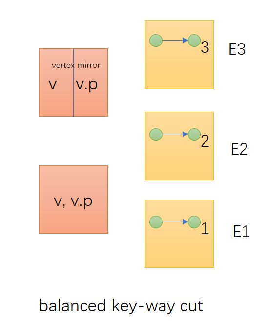
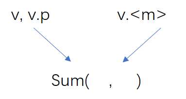
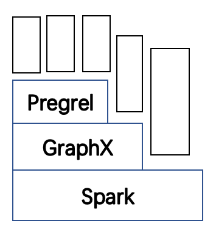

RECAP:

General purpose

Graph processing

* Representation
* Model graph processing
* Graph-specific optimizations

### Pregrel

Update(sum(m), v.value)
Gather, Apply, Scatter

1. B.S.P.
2. Message

### Graphlab
1. DSM
2. Asynchronous processing

### Naiad

### Comparison Aynch / Synch

### GraphX

* Represented? 
	* Vertex collection (vertex, vertex.property)
	* Edge collection (source v, destination v, edge.property)
* Reuse of combinations across different graph over, say, same vertex collection
* indexes on collections, index reuse
* join with non-graph data

## Graph processing model

1. Triplets view

<V,E> (w-way join)

<s, d, s.p, d.p, e.p>

input:trplets view

sendmsg: each triplet -> map -> message

gather: groups message by dest vertex

2. cont. mrtriplets -> vertex, <m>

e.g. 

aggr. contr (PR)

min.value (CC)

union values (GC)

3. 

Join: v, v.p, v.<m>

Map: mapf(v.p, v.<m>) -> v.p(new)

### Performance:

Graph properties to optimize steps 1, 2, 3

1. multicast join: vertices to edge partitions with incident edge
2. subgraph to limit to active vertexs => update vert mirror h.t.
3. Join elimunation - which properlieo are useful for messages

#### mrtriplets

1. co-partition output of sendmsg (similar to RDD co-partition?)
2. Indexes: avoid unneccesary scans of all entries in triplet view.

predicate: active vertices

(index-lookup) index: source -> addr. dst1, dst2

## Reading Chapter

2.1, 3.1, 3.3, 3.4

