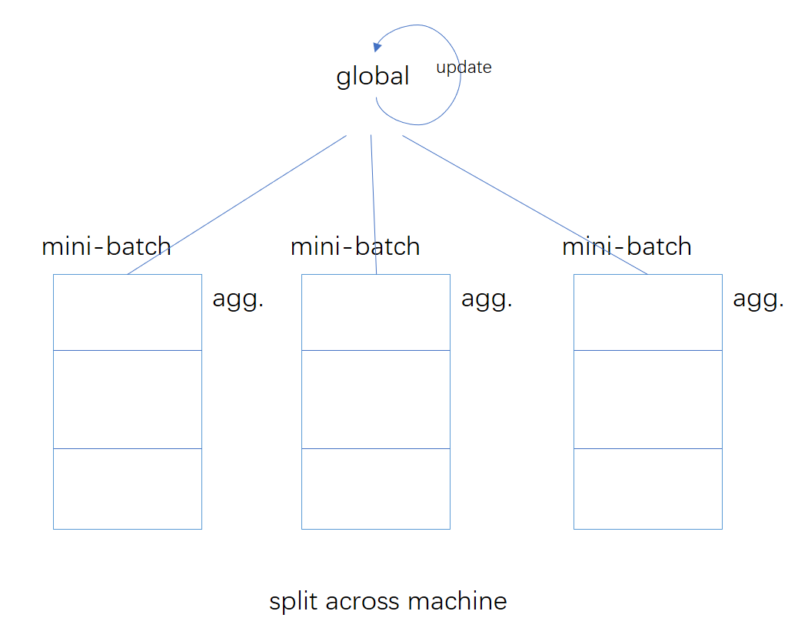
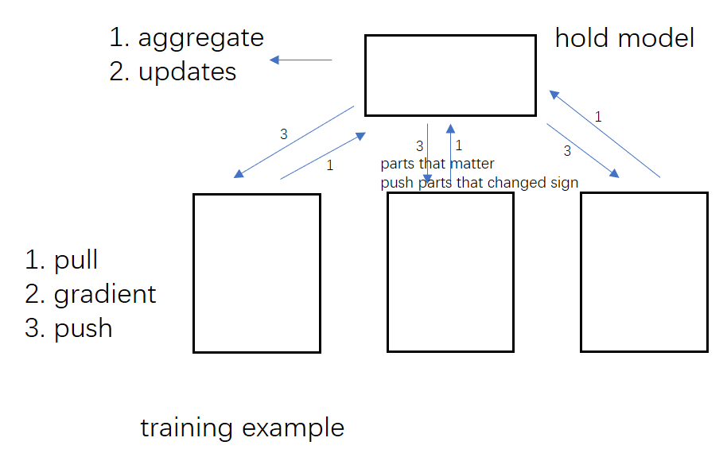

# ML System

* Parameter server: 
	* Large-scale distributed
	* ML
* Deep learning
* ML pipelines, core ML algorithms
* Inference: online		--->	(Clipper)
* Testing & Verification
* How to spped up systems
* Consistency model
* Programmable s/w FPGAs, GPUs, TPUs

BSP, Asynchr, SSP(State Synch Processing), ASP(Asymp. Synch. Pro)

Reinforcement Learning

## ML: Traning Set -> Model

<emails, label> -> clasifier (new email) into spam/not 

<features, label>  -> Model

* LARGE!! BOTH Training data & Model
	* Split across many machines
	* Does not fit in the memory of a single machines
	
1. Data parallel -P.S.
2. Model parallel - Dist Belief STRADS
	* Parameter of hte model <w> -> estimate arameters
	* Objective optimized
		* Prediction error
		* loss function  --> loss (training data, current model) + Reg(model) --> update model --> ...

## Some Problems
1. Stochastic gradient descent
	* negative direction of gradient
	* Step size, learning rate (Hyperparams)
2. Coordinate descent
3. Gibbs sampling

### Approximation: 

### Physic organization
Shared mem-like, scheduler, ...

### synchronous processing
* stragglers
* efficiency

### Asynchronous processing
* each worker: pull,gradient,push update
* next iteration, starts right away

### SSP
* delay fastest and slowest <= k

