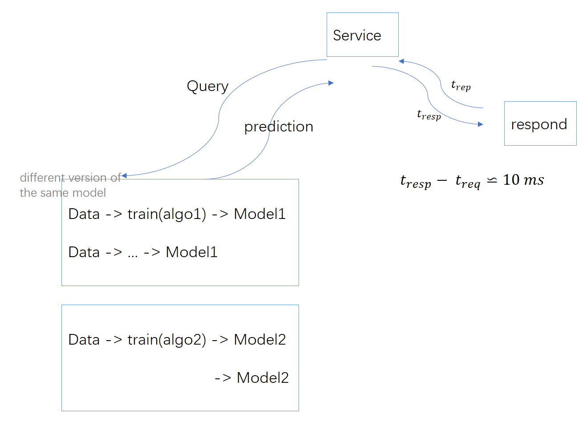
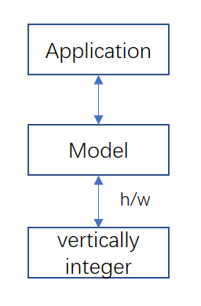
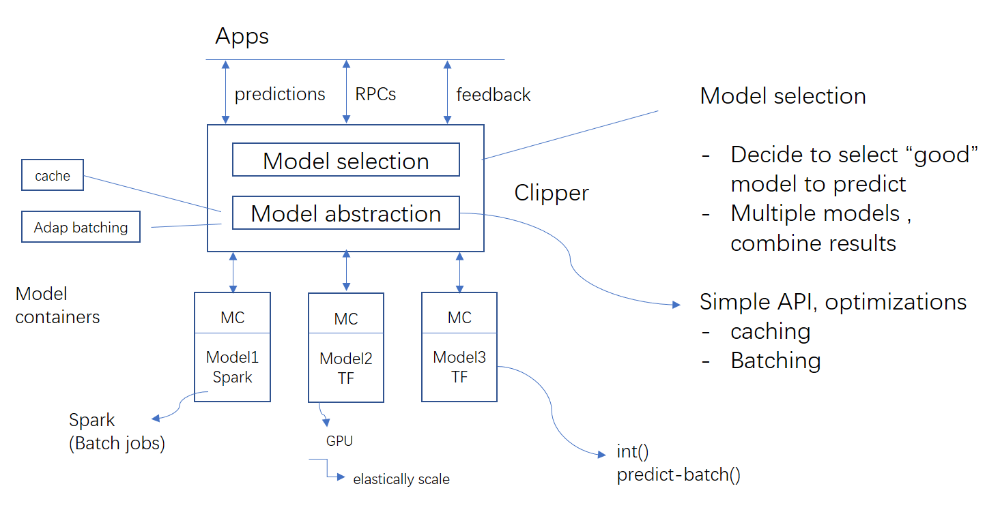
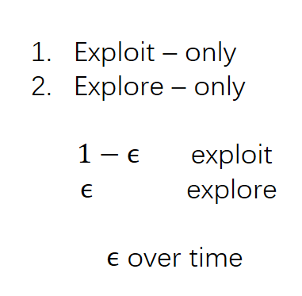

# Prediction Serving

- How its done today?
- Challenges

Clipper - layered approach to prediction serving
	* low-latency and high throughput
	
Model selection - Multiple models

# Problem struc

Complex models -> resource intensive -> GPUs, TPUs

* low latency
* High throughput
* Multiple models / framework
	* new model

* Multiple models ??
	* picking the best: Domain - specific input
	* leverate multiple together (different models solve different parts of the models)
	

Caching benefits: a straitforward optimization
- popuplar queries
- unpopular queries

Batching (Why?)
- H/w: batching h/w parallelism
- RPC: amortizes system overloads
- Challenges: What size, h/w, size

## Many modles (ensemble)

+ better accuracy
- compute resources
- slowdown from stagglers

## Exploit - Explore strategy

	
