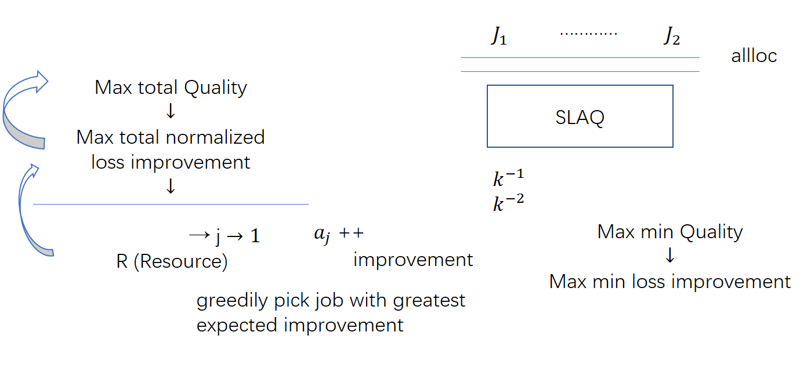

##

Sharing among multiple training jobs

- Why?
	problem statement
- Options
- SLAQ
- Open Problem

Data -> train -> model

iterative, quality, time

1. Tenants (Each job as ..) -> cloud
2. Exploration
3. Collection

Objective
- Maximize total quality across the model s.t. time to reah is \leq T
- min Makespan s.t. min Quality  \geq Q
- ~within time T~
	Max average uqality improvement sub to capacity constraints
	
Optimize:
* max total Quality
* max run Quality

Allocate
- Workers
- Progress per job  --> loss function
- how much additional progress
	- how many iterations execute
	- how much would quality improve

	
normalized
	loss function improvement
		loss function change (\delta)
		largest change so far (time per iteration = \frac{c \times S}{N}) disk I/O | network I/O
		
